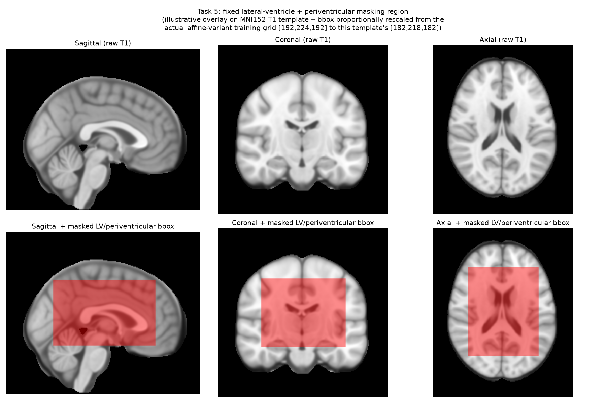

# Task 5 — Polymicrogyria (PMG) Classification

**Final submission**: 5-fold ensemble of `FomoTask1Arch18Net` (see
`common/asparagus/`) on affine-registered T1, trained with a lateral-
ventricle masking augmentation, 30 epochs, per-fold 16-view test-time
averaging (original + LR-mirrored orientations, 8 noise draws each).

## The problem this pipeline addresses

Early baseline models (`training/asparagus_orchestrate_task5.py`, a 6-way
sweep over {hdbet_only, rigid, affine} × {0.7mm, 1.0mm}) scored well
locally (pooled held-out AUROC ~0.83–0.89) but near or below chance on the
real leaderboard for the rigid/affine variants (0.398 / 0.396) — a large
local/real gap. Two independent diagnostics (`analysis/`) converged on the
same explanation:

- **`analysis/task5_lr_asymmetry.py`**: population-level left-right
  asymmetry analysis (all 48 subjects) found a striking PMG-vs-control
  difference concentrated in the periventricular region — but a per-subject
  quantitative check (Welch/Mann-Whitney) found this difference was **not
  statistically significant** at the individual level, consistent with the
  model latching onto per-fold noise near the ventricle rather than a real,
  generalizable signal.
- **`analysis/task5_smoothgrad.py`**: SmoothGrad saliency on the un-masked
  classifier showed attention concentrated on the lateral-ventricle
  boundary rather than the cortex, where PMG's actual pathology (a
  gray-matter cortical-folding malformation) lives.

## The fix: ventricle masking

`analysis/task5_build_ventricle_mask.py` derives a fixed lateral-ventricle
+ periventricular bounding box from a 48-subject population CSF-consistency
map (eroded to drop the thin 3rd-ventricle/interhemispheric-fissure sliver,
then re-expanded to also cover immediately surrounding tissue).

During training, this fixed region is always corrupted with local-mean/std-
matched Gaussian noise (`Torch_LVFixedMask`, see
`common/asparagus/asparagus/modules/transforms/presets/train.py`),
denying the model that shortcut.

*Illustrative reconstruction* of the masked region (the exact `_LV_BBOX_AFFINE`
coordinates used in training, proportionally rescaled onto an MNI152 T1
template as a stand-in, since the original PMG dataset no longer exists in
this environment). The original per-subject SmoothGrad before/after
comparison referenced above was run against the real PMG dataset and fold
checkpoints, neither of which survive in this snapshot; this figure shows
*where* the mask sits, not the attention shift itself.

Evaluated with the SAME masking applied at
test time (the fair comparison, since training never saw a clean ventricle):
official-style pooled held-out AUROC climbed monotonically with training
length — 0.868 (10 epochs) → 0.882 (20) → **0.901 (30)** — with no
overfitting, unlike the un-masked recipe (which peaked at 10 epochs and
got worse by 20: 0.830 → 0.814). `analysis/task5_lr_full_diagnostic.py`
and a repeat of the SmoothGrad analysis under matched-masked evaluation
confirmed attention genuinely shifts to the cortical rim once the ventricle
is denied.

## Test-time augmentation

A seeded, cross-validated augmentation-sensitivity probe (rotation, mirror,
scale, gamma, Gibbs ringing, motion ghosting, bias field — see
`analysis/task5_full_sensitivity_rigid_affine.py` for the methodology)
found LR-mirroring to be a small, consistent positive effect across two
independent seeds; mild rotation (±10°) also helped but reversed to
harmful at ±20° (consistent with the fixed-coordinate mask needing
reasonably-aligned input). The final inference recipe averages 16 views
per fold model (8 masked draws × 2 orientations), then averages across all
5 folds.

## Training

`training/asparagus_orchestrate_task5_lv_augment.py` — initial LV-cutout/
fixedmask ablation. `training/asparagus_orchestrate_task5_lv_fixedmask_ep30*`
— the final 30-epoch recipe.
